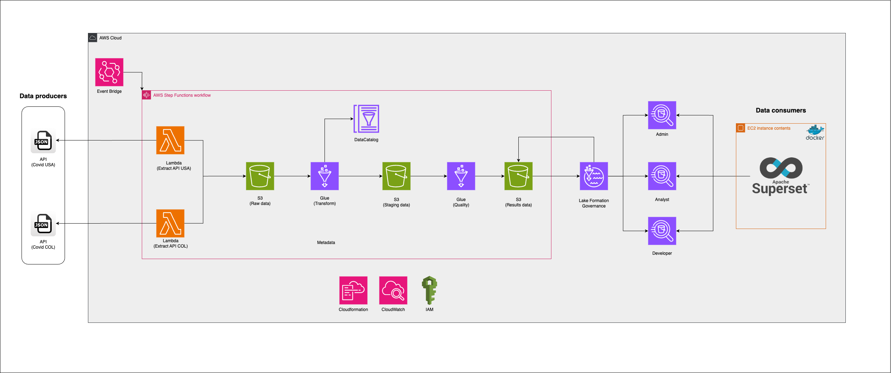

# Proyecto ETL Serverless en AWS (Ingeniería de datos)

¡Bienvenido/a a este proyecto de Ingeniería de Datos que busca democratizar el acceso al conocimiento en este campo, ofreciendo una solución completa de extracción, transformación y carga (ETL) en la nube de AWS bajo una arquitectura **serverless**!


## Tabla de Contenidos
1. [Descripción General](#descripción-general)  
2. [Arquitectura del Proyecto](#arquitectura-del-proyecto)  
3. [Requisitos Previos](#requisitos-previos)  
4. [Estructura del Repositorio](#estructura-del-repositorio)  
5. [Agradecimientos](#agradecimientos)

---

## Descripción General

Este proyecto está diseñado para demostrar cómo construir e implementar un **pipeline de datos** (ETL) utilizando servicios **serverless de AWS**, facilitando su escalado, mantenimiento y reducción de costos. En términos generales, se conecta a dos APIs externas para la extracción de datos, los almacena en diversas capas dentro de Amazon S3, los transforma usando AWS Glue y expone los resultados para consultas a través de Athena y visualizaciones en Superset.

El objetivo es proporcionar un ejemplo completo y práctico de soluciones de **Data Engineering** para la comunidad de habla hispana interesada en tecnologías en la nube, data lakes y servicios administrados de AWS.

---

## Arquitectura del Proyecto

La arquitectura serverless propuesta se compone de los siguientes servicios de AWS:

- **AWS Lambda**  
  - Desencadena y ejecuta el código en Python que se conecta a dos APIs diferentes para extraer datos y almacenarlos en S3.

- **Amazon S3**  
  - Almacena la información en diferentes “zonas” o capas de datos:  
    - **Raw**: Datos crudos, recién llegados desde la API.  
    - **Staging**: Datos procesados o limpios en transición.  
    - **Results**: Datos finales listos para el análisis y consumo.

- **AWS Glue**  
  - Ejecuta el código de transformación en **PySpark** para convertir los datos a formato **Parquet** y ajustar tipos de datos según sea necesario.

- **AWS Glue Data Catalog**  
  - Registra la **metadata** de las bases de datos y tablas generadas tras el proceso de transformación.

- **AWS Lake Formation**  
  - Facilita la gobernanza de datos (permisos y control de accesos) dentro del Data Lake.

- **Amazon Athena**  
  - Realiza consultas SQL directamente sobre los datos almacenados en S3, valiéndose de la metadata en AWS Glue Data Catalog.

- **Apache Superset**  
  - Permite la **visualización de datos** para crear paneles interactivos (dashboards) y reportes a partir de las consultas en Athena.

> **Nota**: A continuación se muestra un diagrama conceptual (usar uno propio si se requiere).  
> 

---

## Requisitos Previos

1. **Cuenta de AWS** con permisos para crear y administrar:
   - Recursos de **Lambda**, **S3**, **Glue**, **Data Catalog**, **Lake Formation** y **Athena**.
   - Roles de IAM necesarios para la ejecución de los servicios.
2. **AWS CLI** instalado y configurado (versión 2.0 o superior).
3. **Python 3.7+** instalado localmente para ejecutar scripts adicionales si fuera necesario.
4. **Docker** instalado si se desea desplegar **Superset** en contenedores.

---

## Estructura del Repositorio

Este repositorio se compone de las siguientes carpetas y archivos principales:

```bash
├── IaC/
│   ├── master.yaml
│   ├── parameters.yaml
│   ├── template-ec2.yaml
│   ├── template-eventbridge.yaml
│   ├── template-glue.yaml
│   ├── template-iam.yaml
│   ├── template-kms.yaml
│   ├── template-lambdas.yaml
│   ├── template-s3.yaml
│   ├── template-step.yaml
├── lambda/
│   ├── lambda_function_COL.py # Código en Python para conectar con las APIs y cargar en S3.
│   └── lambda_function_USA.py  # Código en Python para conectar con las APIs y cargar en S3.
├── glue_code/
│   ├── transform.py   # Código en PySpark para transformación de datos a formato parquet.
│   └── quality.py  # Código en PySpark para transformación y calidad de datos.
├── superset/
│   ├── docker-compose.yaml
│   ├── Dockerfile.superset
│   ├── entrypoint.sh
└── .gitignore
└── README.md  # (Este archivo)
```

## Agradecimientos

Al equipo de ingenieros de datos de la comunidad **Data Clouders** que participaron del diseño e implementación de este proyecto: 

- Simon Jaramillo Velez. 
- Diego Alejandro Lopez.
- Luis Felipe Castaño Villada.

# PD: Si van a desplegar el projecto, recuerden agregar el subnetid y vpcid de su cuenta 